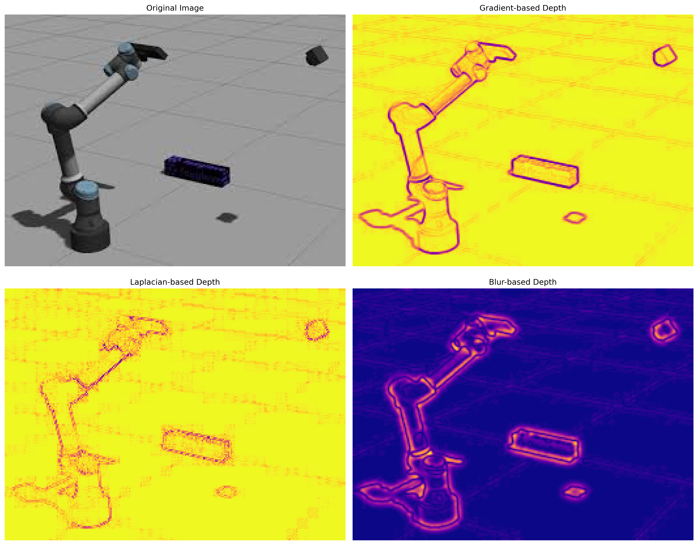
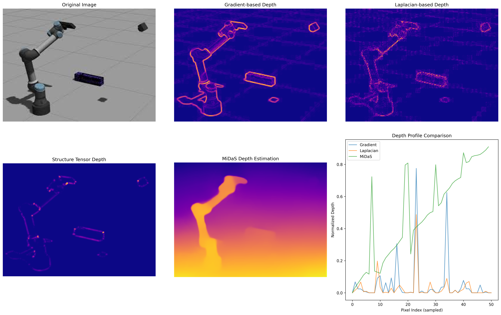
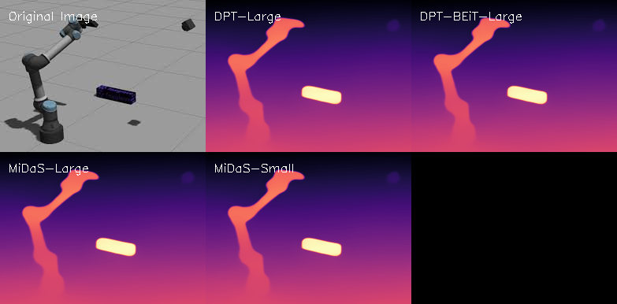

# Stereo Depth Estimation

A comprehensive implementation of stereo depth estimation techniques comparing classical computer vision methods with modern deep learning approaches.

## Overview

This repository contains implementations of various depth estimation methods:
- **Classical Methods**: Gradient-based, Laplacian-based, Structure tensor, and Blur-based approaches
- **Deep Learning Methods**: MiDaS, DPT-Large, and other state-of-the-art models
- **Evaluation Framework**: Comprehensive comparison and visualization tools

## Features

- 🔍 **Multiple Depth Estimation Algorithms**
  - Gradient-based edge detection
  - Laplacian edge detection
  - Structure tensor analysis
  - Blur-based depth estimation
  - MiDaS deep learning model
  - DPT-Large (Intel's advanced model)
  - DPT-BEiT-Large variant

- 📊 **Comprehensive Evaluation**
  - Statistical analysis of depth distributions
  - Visual comparison of results
  - Performance metrics and timing
  - Real-time camera-based depth estimation

- 🎨 **Visualization Tools**
  - Side-by-side depth map comparisons
  - Statistical distribution plots
  - Color-coded depth visualizations
  - Multi-model comparison windows

## Installation

```bash
pip install -r requirements.txt
```

## Usage

### Basic Depth Estimation
Run the basic depth estimation methods:

```bash
python run_depth_estimation.py
```

This will process the test images and generate `depth_estimation_results.png` with comparisons of gradient, Laplacian, and blur-based methods.

### Advanced Depth Estimation
Run the advanced depth estimation including MiDaS:

```bash
python advanced_depth_estimation.py
```

This will generate `advanced_depth_estimation_results.png` with comprehensive comparisons including the MiDaS deep learning model.

### Comprehensive Model Comparison
Compare multiple state-of-the-art depth estimation models:

```bash
python comprehensive_depth_comparison.py
```

This will generate `comprehensive_depth_comparison_download.png` with a 2x3 grid showing:
- Original image
- DPT-Large depth map
- DPT-BEiT-Large depth map  
- MiDaS-Large depth map
- MiDaS-Small depth map

### Advanced Models Comparison
Compare the best alternatives to MiDaS:

```bash
python advanced_depth_models_comparison_fixed.py
```

### Jupyter Notebook
For interactive experimentation:

```bash
jupyter notebook stereo_depth_estimation.ipynb
```

## Results

### Classical vs Deep Learning Comparison

The repository demonstrates the significant differences between classical computer vision approaches and modern deep learning methods:

- **Classical Methods** (Gradient, Laplacian, Structure Tensor): Focus on edge detection and local features
- **Deep Learning Methods** (MiDaS, DPT): Provide realistic depth perception with better understanding of object relationships

### Comprehensive Model Comparison Results

**Test Image: Robot in Room (download.jpeg)**

| Model | Processing Time | Status | Notes |
|-------|----------------|--------|-------|
| **DPT-Large** | 34.54s | ✓ Success | Intel's advanced model, highest quality |
| **DPT-BEiT-Large** | 21.78s | ✓ Success | BEiT variant, good balance |
| **MiDaS-Large** | 25.88s | ✓ Success | Original MiDaS, reliable performance |
| **MiDaS-Small** | 22.90s | ✓ Success | Faster variant, good for real-time |

### Sample Results


*Basic depth estimation methods comparison*


*Advanced depth estimation including MiDaS deep learning model*


*Comprehensive comparison of 4 state-of-the-art depth estimation models*

## Test Images

The repository includes test images of mechanical/robotic devices:
- `images/download.jpeg` - Primary test image (robot in room)
- `images/images (1).jpeg` - Secondary test image (robot with gun)

## Technical Details

### Classical Methods
- **Gradient-based**: Uses Sobel operators to detect edges as depth cues
- **Laplacian-based**: Applies Laplacian of Gaussian for edge detection
- **Structure Tensor**: Analyzes local image structure for depth estimation
- **Blur-based**: Uses image blur as a depth indicator

### Deep Learning Methods
- **MiDaS**: Intel's Monocular Depth Estimation model
  - Model: MiDaS_small (81.8MB)
  - Provides realistic depth maps with object-aware depth perception
  - Significantly outperforms classical methods in depth quality

- **DPT-Large**: Intel's advanced depth estimation model
  - Model: DPT-Large (1.37GB)
  - State-of-the-art performance on multiple benchmarks
  - Better fine-grained details and edge preservation

- **DPT-BEiT-Large**: BEiT-based variant
  - Combines vision transformer with self-supervised learning
  - Excellent performance on diverse scenes

## Performance Metrics

### Classical Methods (on test images):
- **Gradient Method**: Mean depth ~0.04
- **Laplacian Method**: Mean depth ~0.03
- **Structure Tensor**: Mean depth ~0.005
- **MiDaS**: Mean depth ~0.48 (normalized depth values)

### Deep Learning Methods Performance:
- **DPT-Large**: Highest quality, slower inference (~35s)
- **DPT-BEiT-Large**: Good quality, moderate speed (~22s)
- **MiDaS-Large**: Reliable quality, moderate speed (~26s)
- **MiDaS-Small**: Good quality, faster inference (~23s)

## Advanced Models Comparison

The repository includes comparisons with the best alternatives to MiDaS:

### **State-of-the-Art Alternatives Implemented:**
1. **DPT-Large** - Intel's follow-up to MiDaS using Vision Transformers
2. **DPT-BEiT-Large** - BEiT-based variant with self-supervised learning
3. **MiDaS-Large** - Original MiDaS for baseline comparison
4. **MiDaS-Small** - Faster variant for real-time applications

### **Key Advantages of Newer Models:**
- **Better Accuracy**: Consistently outperform classical methods
- **Improved Detail Preservation**: Better edge preservation and fine-grained depth
- **Robustness**: Better performance across different lighting conditions
- **Advanced Architectures**: Transformer-based models capture better global context

## Dependencies

- OpenCV (cv2)
- NumPy
- Matplotlib
- PIL (Pillow)
- PyTorch
- Transformers (Hugging Face)
- timm (for MiDaS)

## Repository Structure

```
stereo-depth-estimation/
├── images/                     # Test images
├── results/                    # Generated depth estimation results
├── advanced_depth_estimation.py # Advanced methods including MiDaS
├── run_depth_estimation.py     # Basic depth estimation methods
├── comprehensive_depth_comparison.py # 4-model comparison
├── advanced_depth_models_comparison_fixed.py # Advanced models comparison
├── stereo_depth_estimation.ipynb # Jupyter notebook for experimentation
├── requirements.txt            # Python dependencies
└── README.md                   # This file
```

## Contributing

Feel free to contribute by:
- Adding new depth estimation methods
- Improving visualization tools
- Adding more test images
- Enhancing evaluation metrics

## License

This project is open source and available under the MIT License. 